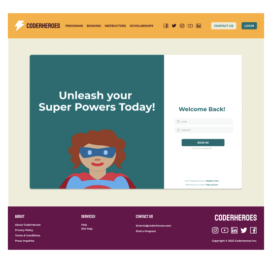
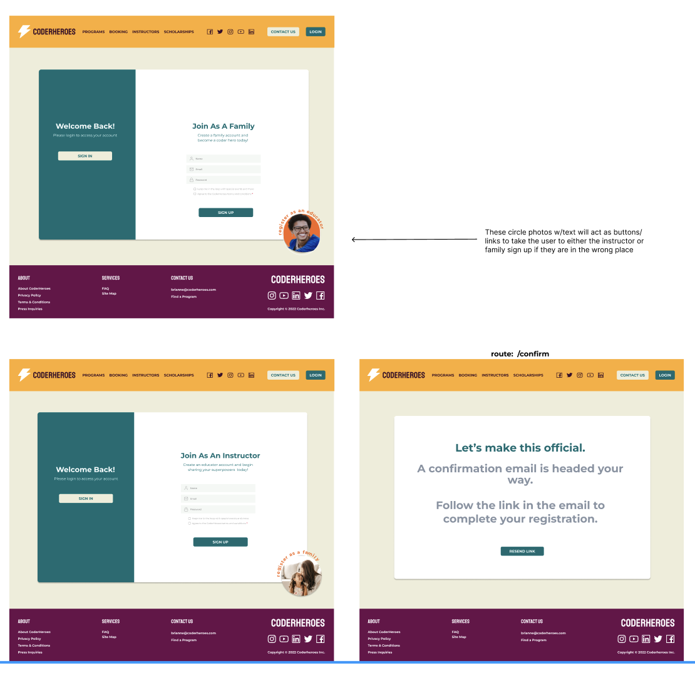

# instructor-registration-flow

<h2>We consulted with our design manager Swapnali and decided to update the font colors of the previous flow and corrected the step progression bar. We also added a section in the unauthorized instructor page that has a button to be linked to the instructor registration form.</h2>

[Loom](https://www.loom.com/share/dc4705c4118e44bb82f418011ffc4b10)

# Instructor page with link to instructor sign up:

</img>

# Login page with link to instructor sign up:

</img>

# Sign ups with redirecting picture/buttons:

</img>

# Step 1 and 2 of instructor sign up:

</img>

# Confirmation page for instructor sign up:

</img>
